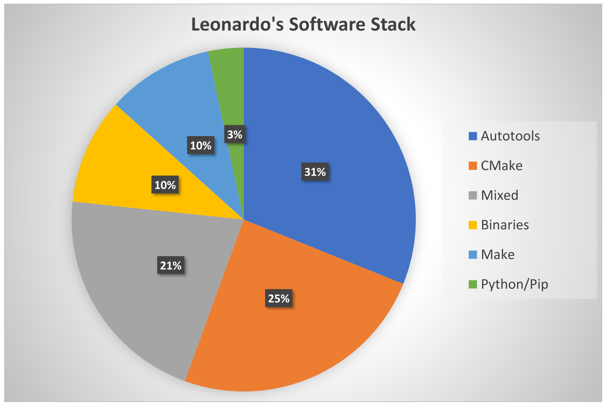
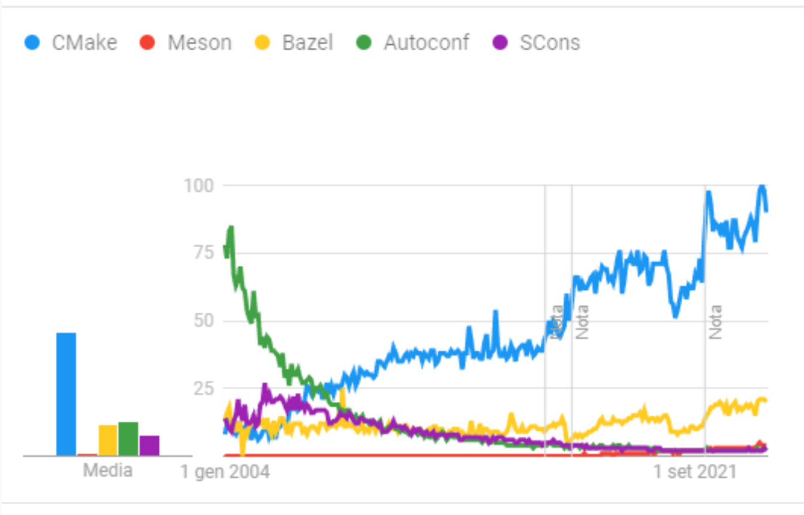

# Laboratory 12
## Build and distribution systems

### Paolo Joseph Baioni
### 29/05/2026

---
## Outline
1. CMake recap
2. Why CMake
3. Resources
4. Example build workflow
5. Project organization

---
## Outline
7. Containers in HPC
8. Podman and Apptainer
9. HPCCM
10. Spack overview
11. Installing and basic usage
12. Specs, compilers and modules

---
## Build systems

Build systems are a way to deploy software.

They are used to
1. provide others a way to configure your own project;
2. configure and install third-party software on your system.

Configure usually means:
- meet dependencies
- build
- test

---
## Why CMake?

- increasingly more packages use CMake than any other system
- almost every IDE supports CMake
- really cross-platform, especially for Linux, macOS and Windows
- extensible, modular design

Examples:
- Netflix
- HDF5, VTK, ParaView
- Armadillo, CGAL, LAPACK, Trilinos
- deal.II, Gmsh
- KDE, Qt, ReactOS

---
## Build Systems on HPC



[Leonardo](https://www.hpc.cineca.it/systems/hardware/leonardo/) ([top 10 HPC 2025](https://www.top500.org/lists/top500/2025/11/)) software stack at CINECA in 2024.

---
## Trends



Google Trends 2024 snapshot.

---
## Resources

- [CMake 2025 recording (Polimi SSO)](https://politecnicomilano.webex.com/politecnicomilano/ldr.php?RCID=6a3143410ee621eb3201a2e041f99b37)
- Official documentation  
  <https://cmake.org/cmake/help/latest/>
- Modern CMake  
  <https://cliutils.gitlab.io/modern-cmake/>
- It's time to do CMake right  
  <https://pabloariasal.github.io/2018/02/19/its-time-to-do-cmake-right/>
- Effective Modern CMake  
  <https://gist.github.com/mbinna/c61dbb39bca0e4fb7d1f73b0d66a4fd1>
- More Modern CMake  
  <https://www.youtube.com/watch?v=y7ndUhdQuU8&feature=youtu.be>

---
## CMake usage example

Compile and, if needed, install.

**{fmt}** (<https://github.com/fmtlib/fmt>)

```bash
cd /path/to/fmt/src/
mkdir build && cd build
cmake ..
make -j<N>
make test
(sudo) make install
```

---
## Autotools usage example
GNU Scientific Library (<https://www.gnu.org/software/gsl/>)

```bash
cd /path/to/gsl/src/
./configure --prefix=/opt/gsl --enable-shared --disable-static
make -j<N>
(sudo) make install
```

---
## Large project layout

```text
ScientificProject/
├── CMakeLists.txt
├── README.md
├── LICENSE
├── .gitignore
├── cmake/
│   └── FindSomeLib.cmake
├── include/
│   ├── module1/
│   │   ├── module1.h
│   │   └── module1_utils.h
│   └── module2/
│       ├── module2.h
│       └── module2_utils.h

```

---
## Large project layout

```text
├── src/
│   ├── CMakeLists.txt
│   ├── main.cpp
│   ├── module1/
│   │   ├── CMakeLists.txt
│   │   ├── module1.cpp
│   │   └── module1_utils.cpp
│   └── module2/
│       ├── CMakeLists.txt
│       ├── module2.cpp
│       └── module2_utils.cpp
```
---
## Large project layout

```text
├── tests/
│   ├── CMakeLists.txt
│   ├── test_module1.cpp
│   ├── test_module2.cpp
│   └── test_utils.cpp
├── data/
│   ├── dataset1.csv
│   └── dataset2.csv
├── docs/
│   ├── API.md
│   └── UserGuide.md
└── scripts/
│   ├── do_something.sh
│   ├── another_script.py
──────────────────────────
```

---
# Containers in HPC - refresh from Lab 0
 - podman: OCI (as Docker) compatible, no sudo, sees the shared folder only
 - apptainer: HPC oriented, no sudo,  uses FUSE to manage container file systems
 - alternatives: docker (creation) + sarus (execution) [https://github.com/eth-cscs/sarus](https://github.com/eth-cscs/sarus)

---
# Podman hello world
See hello-world.dockerfile
```bash
podman build -t hello-world:v1 -f hello-world.dockerfile .
podman run --rm -it hello-world:v1 /usr/local/bin/hello
```

---
# Podman hello world - multistage
See hello-world-multistage.dockerfile
```bash
podman build -t hello-world:v2 -f hello-world-multistage.dockerfile .
podman run --rm -it hello-world:v2 /usr/local/bin/hello
podman images
```

---
# Repositories & Apptainer
You can upload the container image to repositories such as [https://quay.io/repository/](https://quay.io/repository/) (free registration required to upload, and to follow the [https://quay.io/tutorial/](https://quay.io/tutorial/) ).

Then, you can build apptainer containers from podman ones, eg
```bash
apptainer pull docker://quay.io/pjbaioni/pacs
```

---
# Apptainer from recipe
```bash
apptainer build ada.sif ada.apptainer_recipe
apptainer exec ada.sif gnatmake hello.adb && \
apptainer exec ada.sif gnatbind -x hello.ali && \
apptainer exec ada.sif gnatlink hello.ali && \
apptainer exec ada.sif ./hello
```

---
# HPCCM & Python Envs
High-Performace Computing Container Maker provides a python based higher level interface to container definitions, already following best practices for docker (default, podman compatible) and singularity (apptainer compatible)
It can be installed in the **recommended** way to install python packages 
```bash
python3 -m venv hpccm
source hpccm/bin/activate
pip install --upgrade pip
pip install hpccm
```

---
# HPCCM & Python Envs
Example usage
```bash
hpccm --recipe compilers.hpccm --format singularity > compilers.apptainer
hpccm --recipe compilers.hpccm --format docker > compilers.podman
deactivate
apptainer build compilers.sif compilers.apptainer
apptainer shell compilers.sif
```

---
# Spack
Spack is a multi-platform package manager that builds and installs multiple versions and configurations of software. It works on Linux, macOS, Windows, and many supercomputers. Spack is non-destructive: installing a new version of a package does not break existing installations, so many configurations of the same package can coexist.

Spack offers a simple "spec" syntax that allows users to specify versions and configuration options. Package files are written in pure Python, and specs allow package authors to write a single script for many different builds of the same package. 

---
# Installing

Clone the repository
```bash
git clone -c feature.manyFiles=true --depth=1 --branch \
releases/v1.0 https://github.com/spack/spack spack-1.0
```

---
# First steps

setup the environment
```bash
source spack-1.0/share/spack/setup-env.sh
```

list available packages (slow first time)
```bash
spack list
```

optional: tune configuration
```bash
find spack-1.0 -iname "config.yaml" 2>/dev/null
nano -liST 2 spack-1.0/etc/spack/defaults/config.yaml 
```
(eg, edit spack-stage, stage, test and cache dirs; see spack.diff)

---
# Basic usage

```bash
spack info gcc
spack install gcc@14.2.0
which gcc
spack load gcc
which gcc 
spack unload --all
```

---
# Specs

Default ones
```bash
spack spec -ll gcc
```
Setting specs
```bash
$ spack install mpileaks                           :  unconstrained
$ spack install mpileaks@3.3                       @: custom version
$ spack install mpileaks@3.3 %gcc@4.7.3            %: custom compiler
$ spack install mpileaks@3.3 %gcc@4.7.3 +threads   +/- build option
$ spack install mpileaks@3.3 cppflags="-O3 –g3"        set compiler flags
$ spack install mpileaks@3.3 target=cascadelakeset     target microarchitecture
$ spack install mpileaks@3.3 ^mpich@3.2 %gcc@4.9.3 ^: dependency constraints
```

---
# Compilers & toolchains

Get compilers list: `spack compilers` or
```bash
spack config get compilers
```
equivalently
```bash
cat ~/.spack/linux/compilers.yaml 
```
After having installed and loaded a new compiler, update compilers list and check the result
```bash
spack load gcc@14.2.0
spack compiler find
spack config get compilers
```

---
# Compilers & toolchains
Check installed packages with `spack find`
Now you can use that compiler to build new packages, eg
```bash
spack install intel-oneapi-tbb%gcc@14.2.0
```
Check again installed packages with `spack find`

Thus, your installation is independent from OS compiler version and more portable and reproducible. 
Packages compiled with a specific compiler can be found with 
```bash
spack find %<compiler>@version
```

---
# Example of application
```bash
git clone https://github.com/pacs-course/pacs-Labs.git
cd pacs-Labs/Labs/2025/04-algorithms_and_execution_policies
spack load intel-oneapi-tbb@2022.0.0
spack find --loaded
g++ -std=c++23 bandwidth.cpp -O3 -ltbb -o bandwidth
./bandwidth 100000000&
top
spack unload --all 
```
(exit `top` with `q`)
Specific find usage: `spack find -ldv intel-oneapi-tbb`

---
# Build your own module system

Requires either
 - [https://github.com/envmodules/modules](https://github.com/envmodules/modules)
 - [https://github.com/TACC/Lmod](https://github.com/TACC/Lmod)   

Here we refer to `apt info environment-modules`, but they can be installed via spack too.
```bash
sudo apt install environment-modules
source /etc/profile.d/modules.sh 
module avail
source spack-1.0/share/spack/setup-env.sh
spack module tcl refresh -y 
module avail
module load gcc/14.2.0<...> && module load intel-oneapi-tbb/
module list
```

---
# Final words
where to go from here:
 - [https://spack-tutorial.readthedocs.io/en/latest/tutorial_environments.html](https://spack-tutorial.readthedocs.io/en/latest/tutorial_environments.html)
 - [https://spack-tutorial.readthedocs.io/en/latest/tutorial_configuration.html](https://spack-tutorial.readthedocs.io/en/latest/tutorial_configuration.html)
 - [https://spack-tutorial.readthedocs.io/en/latest/tutorial_packaging.html](https://spack-tutorial.readthedocs.io/en/latest/tutorial_packaging.html)


---
# References
 - [https://gitlab.hpc.cineca.it/training/build_system_pkg_manager_hpc](https://gitlab.hpc.cineca.it/training/build_system_pkg_manager_hpc)
 - [https://github.com/spack/spack](https://github.com/spack/spack)
 - [https://github.com/NVIDIA/hpc-container-maker](https://github.com/NVIDIA/hpc-container-maker)
 - [https://podman.io/](https://podman.io/)
 - [https://apptainer.org/](https://apptainer.org/)

