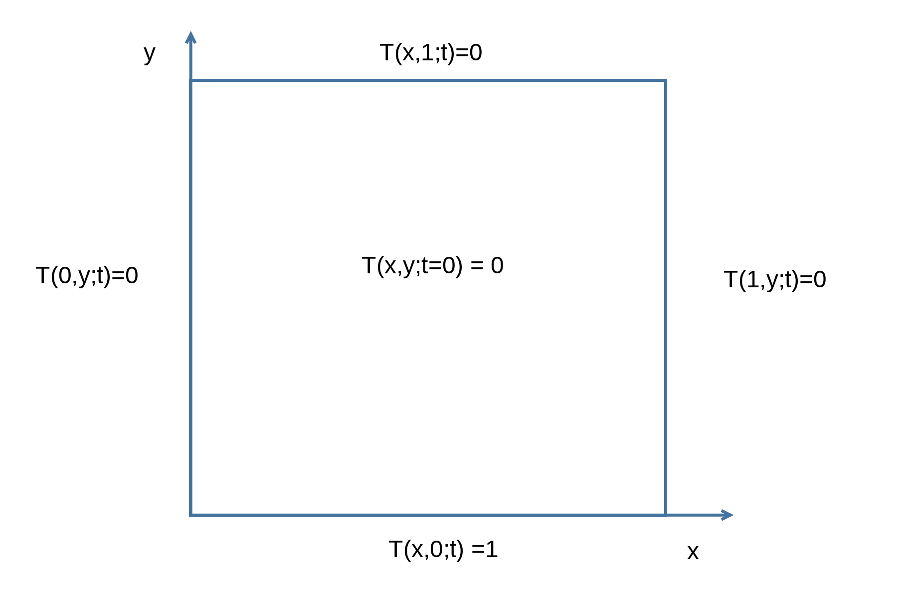
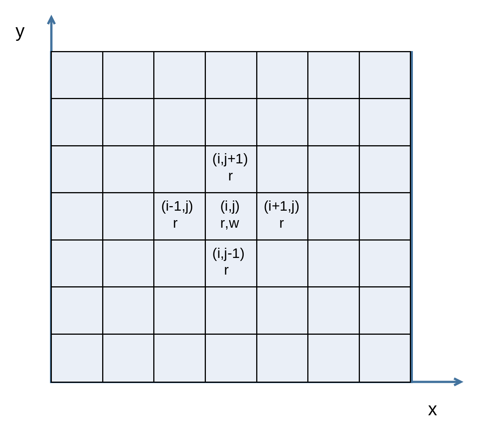
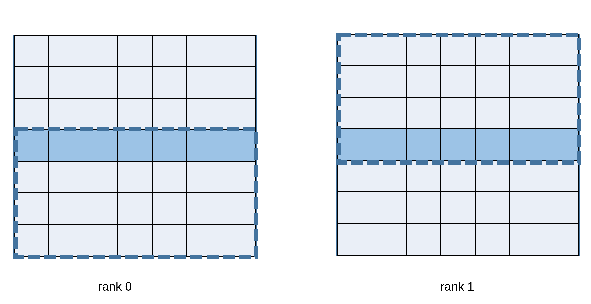
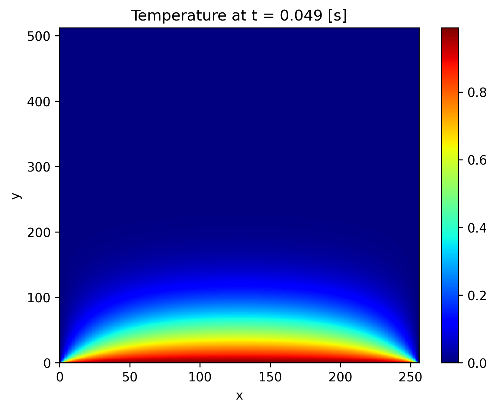

# Laboratory 13
## MPI, C++ concurrency, and sender/receiver execution

### Paolo Joseph Baioni
### 05/06/2026

---
## Outline
1. MPI-based heat-equation solver
2. Adding C++ standard-library concurrency
3. Refactoring with [P2300 `std::execution`](https://www.open-std.org/jtc1/sc22/wg21/docs/papers/2024/p2300r10.html)

---

# Prerequisites

For part 3 we use NVIDIA's [`stdexec`](https://github.com/NVIDIA/stdexec) implementation. It is included as a submodule: if you did not clone this repository with `--recursive`, the `stdexec` directory may be empty.

In that case, run:
```bash
git submodule update --init --recursive
```
Alternatively, clone `stdexec` manually:
```bash
git clone --depth=1 https://github.com/NVIDIA/stdexec.git
```

---
# Note on toolchains

The solution `Makefile` defaults to the GNU toolchain.

With Clang/Open MPI, you might use Clang as the backend compiler while keeping `libstdc++`, for example:

```bash
OMPI_CXX=clang++ mpicxx -stdlib=libstdc++ -std=c++23 \
  -I../stdexec/include -O3 -ffast-math -march=native -DNDEBUG \
  -o 03_senders_and_receivers 03_senders_and_receivers.cpp -ltbb
```
Using `-stdlib=libc++` may fail because the required C++23 ranges and parallel algorithm facilities may not yet be available in that standard library.

---

# Application: 2D heat equation

We solve the 2D heat equation using a finite-difference discretization on a rectangular domain.

Each MPI rank owns a vertical slice of the domain plus two halo layers.



---

# Grid and stencil

Each time step updates one point from its four direct neighbors:

$$
T_{i,j}^{n+1} = (1 - 4\gamma)T_{i,j}^{n}
 + \gamma(T_{i+1,j}^{n} + T_{i-1,j}^{n}
 + T_{i,j+1}^{n} + T_{i,j-1}^{n})
$$



---

# Halo exchange

Before updating boundary cells, ranks exchange halo data with their neighbors.



---

# 1. MPI-based heat-equation solver
## From `exercise.cpp` to `01_mpi.cpp`

Complete:

- C++ ranges and parallel algorithms for the stencil loop
- MPI initialization and rank discovery
- blocking halo exchange with `MPI_Send` and `MPI_Recv`
- global energy reduction with `MPI_Reduce`
- final parallel file output with MPI-IO

---

# Parallel I/O

We write one binary output file:

- global dimensions
- final physical time
- one contiguous field block per rank

Relevant MPI routines:

- [`MPI_File_open`](https://docs.open-mpi.org/en/main/man-openmpi/man3/MPI_File_open.3.html)
- [`MPI_File_set_size`](https://docs.open-mpi.org/en/main/man-openmpi/man3/MPI_File_set_size.3.html)
- [`MPI_File_iwrite_at`](https://docs.open-mpi.org/en/main/man-openmpi/man3/MPI_File_iwrite_at.3.html)
- [`MPI_Waitall`](https://docs.open-mpi.org/en/main/man-openmpi/man3/MPI_Waitall.3.html)

---

# Visualizing the result

Install the plotting dependencies once, if needed:

```bash
python -m venv ~/my_env
source ~/my_env/bin/activate
pip install --upgrade pip
pip install numpy matplotlib
```
Then plot any binary output from the `solution` directory:

```bash
make plot OUTPUT=output_01
```

(The default is `OUTPUT=output`)

---
# Visualizing the result

Expected plot:



---

# 2. Adding C++ standard-library concurrency
## From `01_mpi.cpp` to `02_mpi+concurrency.cpp`

The three local updates are independent after their required halo communication:

- `prev`
- `next`
- `inner`

We assign them to three host threads.

---

# MPI and host threads

Plain `MPI_Init` is no longer enough once multiple host threads may call MPI.

Use:

```cpp
MPI_Init_thread(&argc, &argv, MPI_THREAD_MULTIPLE, &mt);
```

Then check that the provided support level is [`MPI_THREAD_MULTIPLE`](https://docs.open-mpi.org/en/main/man-openmpi/man3/MPI_Init_thread.3.html).

---

# C++ concurrency tools

We add:

- [`std::thread`](https://www.cppreference.com/w/cpp/thread/thread.html) for the three concurrent tasks
- [`std::atomic<double>`](https://en.cppreference.com/w/cpp/atomic/atomic) for the shared energy accumulator
- [`std::barrier`](https://en.cppreference.com/w/cpp/thread/barrier.html) to separate compute, reduction, reset, and pointer swap phases
- [`MPI_Barrier`](https://docs.open-mpi.org/en/main/man-openmpi/man3/MPI_Barrier.3.html) synchronizes ranks. 
- [`std::barrier`](https://en.cppreference.com/w/cpp/thread/barrier.html) synchronizes threads inside one process.

---

# 3. Refactoring with sender/receiver execution (P2300)
## From `02_mpi+concurrency.cpp` to `03_senders_and_receivers.cpp`

Now we keep the same dependency graph:

```text
prev   \
next    > when_all -> reduce -> print -> swap
inner  /
```

The code moves from manual threads and barriers to composable execution objects.

---

# Sender/receiver idea

A sender describes an asynchronous operation and the values, errors, or completion signal it may produce.

A scheduler says where work should run.

Algorithms such as `then`, `on`, and `when_all` compose work without explicitly writing thread functions and synchronization points.

---

# Why this?

This is not yet a widely available portable production baseline.

It is a working implementation of ideas behind proposed and incoming standard execution facilities, useful to understand where C++ concurrency is heading.

Reference:

[P2300 `std::execution`](https://www.open-std.org/jtc1/sc22/wg21/docs/papers/2024/p2300r10.html)

> expresses dependencies instead of manually coordinating threads

---

# Extra: GPU offloading

The approach shown in the code can also serve as a starting point to investigate GPU offload with `stdpar` and `nvc++`.

Reference on NVIDIA documentation:

[`NVC++ and C++ Standard Parallelism`](https://docs.nvidia.com/hpc-sdk/compilers/hpc-compilers-user-guide/index.html#stdpar-cpp)

The three host threads do not imply three GPUs: MPI ranks, host threads, and GPU execution are independent layers of parallelism.

> MPI ranks distribute the domain across processes/nodes. 
> C++ threads split local work inside one rank: `prev`, `next`, `inner`. 
> `stdpar/nvc++` may offload `std::execution::par` algorithms to a GPU.
> GPU mapping is a deployment/runtime choice.

---

# References

- Open MPI: [`MPI_Init_thread`](https://docs.open-mpi.org/en/main/man-openmpi/man3/MPI_Init_thread.3.html), [`MPI_Barrier`](https://docs.open-mpi.org/en/main/man-openmpi/man3/MPI_Barrier.3.html)
- Open MPI MPI-IO: [`MPI_File_open`](https://docs.open-mpi.org/en/main/man-openmpi/man3/MPI_File_open.3.html), [`MPI_File_set_size`](https://docs.open-mpi.org/en/main/man-openmpi/man3/MPI_File_set_size.3.html), [`MPI_File_iwrite_at`](https://docs.open-mpi.org/en/main/man-openmpi/man3/MPI_File_iwrite_at.3.html), [`MPI_Waitall`](https://docs.open-mpi.org/en/main/man-openmpi/man3/MPI_Waitall.3.html)
- C++ reference: [`<execution>`](https://en.cppreference.com/cpp/header/execution), [`std::execution::par`](https://en.cppreference.com/cpp/algorithm/execution_policy_tag), [`std::thread`](https://www.cppreference.com/w/cpp/thread/thread.html), [`std::atomic`](https://en.cppreference.com/w/cpp/atomic/atomic), [`std::barrier`](https://en.cppreference.com/w/cpp/thread/barrier.html)
- P2300: [`std::execution`](https://www.open-std.org/jtc1/sc22/wg21/docs/papers/2024/p2300r10.html)
- NVIDIA [`stdexec`](https://github.com/NVIDIA/stdexec) and [documentation](https://nvidia.github.io/stdexec/index.html)
- David Olsen, Meeting C++ 2022: [Standard Parallelism: We Need On-Ramps](https://meetingcpp.com/mcpp/slides/2022/Olsen-MeetingCpp-Cpp_Std_Parallelism9578.pdf)
- NVIDIA [`nvc++` standard parallelism](https://docs.nvidia.com/hpc-sdk/compilers/hpc-compilers-user-guide/index.html#stdpar-cpp)
